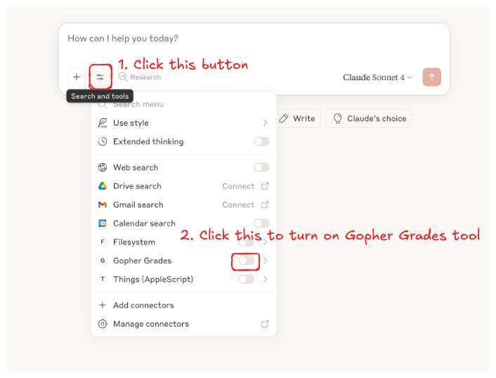

# Gopher Grades MCP 

Gopher Grades MCP is a Python-based Model Context Protocol (MCP) server that enables Large Language Model (LLM) to search and analyze University of Minnesota (UMN) courses, professors, and grade distributions. 

## Features

Gopher grades MCP server provides the following tools: 

| Tool Name                    | Description                                      |
|------------------------------|--------------------------------------------------|
| `search_courses`             | Find UMN courses by department, course number, level, GPA, and keywords. Get course details and grade statistics.                   |
| `get_grades_of_a_course`     | Retrieve detailed grade distributions for a specific course, including breakdowns by professor and term, and liberal education requirements.             |
| `search_professors`          | Look up professors by name or ID, including Rate My Professor scores, difficulty ratings, and courses taught.             |
| `get_grades_of_a_professor`  | Get overall and per-course/term grade statistics for a professor.                  |
| `get_liberal_education_courses` | List courses that fulfill a specific liberal education requirement.    |
| `get_abbreviations_and_terms`   | Access department codes, academic terms and abbreviations.       |


## Installation & Setup

### 1. Installing `uv`
Before installing the Gopher grades MCP server, you need to install `uv` if you haven't yet. See [instructions here](https://docs.astral.sh/uv/getting-started/installation/). 

### 2. Installing Gopher Grades MCP
Please follow the instructions corresponding to your platform.

#### Claude Desktop (Recommended)

- Download and double click [this desktop extension file](gopher-grades-mcp-v1.dxt). Then Claude Desktop should have a pop up window letting you install `Gopher Grades`.
- Enable the `Gopher Grades` tool on Claude Desktop as shown in the screenshot and start chatting. <div align="left">

</div>

#### Custom Setup

```json
{
  "mcpServers": {
    "Gopher Grades": {
      "command": "uv",
      "args": [
        "--directory",
        "ABS/PATH/TO/gopher-mcp-servers",
        "run",
        "server/gopher_grades_server.py"
      ]
    }
  }
}
```


## Example Usage

The following examples are chats from Claude desktop with the Gopher Grades MCP tool enabled:

<div align="center">

</div>


## Acknowledgement

The grades data used in this repository is from [Gopher Grades](https://github.com/samyok/gophergrades)

## License

MIT License


